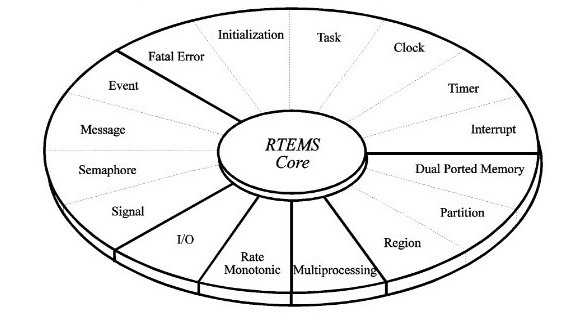

# RTEMS Mulitasking

* Executive provides an interface to other system components such as interrupt
  handlers and device drivers. 

* System components may request the executive to allocate and coordinate
resources, and to wait for and trigger synchronizing conditions. 

* The executive system calls effectively extend the CPU instruction set to
  support efficient multitasking. By causing tasks to travel through
  well-defined state transitions, system calls permit an application to
  demand-switch between tasks in response to real-time events.

* By proper grouping of responses to stimuli into separate tasks, a system can
  now asynchronously switch between independent streams of execution, directly
  responding to external stimuli as they occur. This allows the system design
  to meet critical performance specifications which are typically measured by
  guaranteed response time and transaction throughput.

* By using the directives provided by RTEMS, the real-time applications
  developer is freed from the problem of controlling and synchronizing multiple
  tasks and processors. In addition, one need not develop, test, debug, and
  document routines to manage memory, pass messages, or provide mutual
  exclusion. 

* RTEMS provides the following set of services:

> About 32 bit or 64 bit:
> RTEMS was designed to make no assumptions concerning the characteristics of
> individual microprocessor families or of specific support hardware. 

### Good boy rtems

On Portability:
> The use of RTEMS allows the development of real-time applications which can
> be completely independent of a particular microprocessor architecture.

On Memory Usage:
> Features such as networking, various fileystems, and many other features are
> completely optional. This allows the application designer the flexibility to
> tailor RTEMS to most efficiently meet system requirements while still
> satisfying even the most stringent memory constraints. As a result, the size
> of the RTEMS executive is application dependent.

On definitions:
> A number of type definitions are provided by RTEMS and can be found in
> rtems.h.
